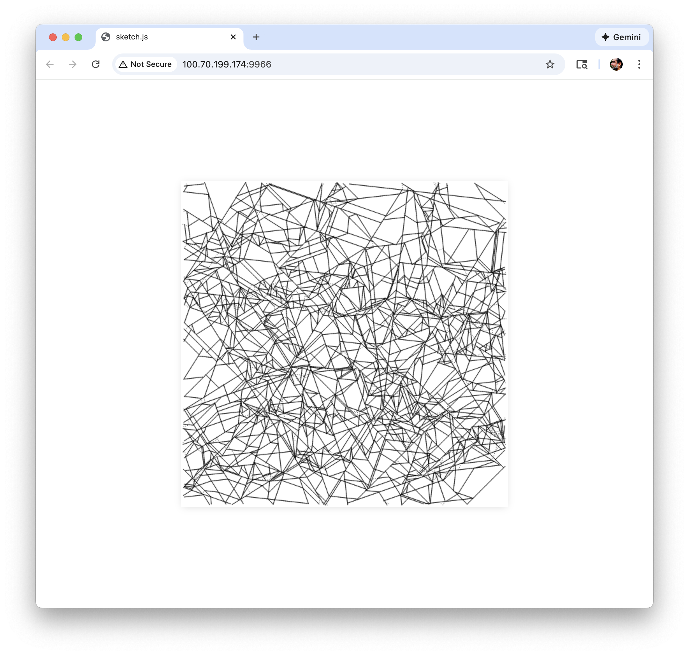

# Ephemeral Accumulation for Human Time Scale




A generative art sketch that creates continuous line patterns using an agent-based drawing system. The agent moves across the canvas, drawing lines as it bounces off borders and avoids crossing its own path. Lines accumulate over time while gradually fading away, creating an ephemeral accumulation effect where recent lines are darker and older ones fade to white.


## Features

- **Ephemeral Accumulation**: Lines accumulate over time while gradually fading away, creating layered patterns
- **Continuous Line Drawing**: An agent moves across the canvas, creating intricate line patterns
- **Self-Avoiding Paths**: The agent detects and avoids crossing its own path
- **Border Detection**: Automatically bounces off canvas edges
- **High Resolution**: 512x512 pixels at 300 DPI

## Installation

1. Make sure you have Node.js installed
2. Install dependencies:
```bash
npm install
```

## Running the Project

Start the development server:
```bash
npm start
```

Or use the canvas-sketch CLI directly:
```bash
npx canvas-sketch sketch.js --open
```

The animation will open automatically in your browser.

## Hosting on GitHub Pages

This project can be hosted on GitHub Pages for free. Here's how:

### Option 1: Using the bundled index.html (Easiest)

1. **Push your code to GitHub:**
   ```bash
   git init
   git add .
   git commit -m "Initial commit"
   git branch -M main
   git remote add origin https://github.com/YOUR_USERNAME/ephemeral-accumulation-for-human-time-scale.git
   git push -u origin main
   ```

2. **Enable GitHub Pages:**
   - Go to your repository on GitHub
   - Click **Settings** → **Pages**
   - Under **Source**, select **Deploy from a branch**
   - Choose **main** branch and **/ (root)** folder
   - Click **Save**

3. **Your site will be live at:**
   `https://YOUR_USERNAME.github.io/ephemeral-accumulation-for-human-time-scale/`

### Option 2: Build and export for static hosting

If you want to create a fresh build:

```bash
# Build a static version
npx canvas-sketch sketch.js --build --name index
```

Then commit the generated `index.html` and enable GitHub Pages as above.

## Saving Your Artwork

### Keyboard Shortcuts

- **Save as PNG:**
  - Mac: `Cmd + S`
  - Windows/Linux: `Ctrl + S`
  - Saves the current frame as a PNG file

- **Save with custom filename:**
  - Mac: `Cmd + Shift + S`
  - Windows/Linux: `Ctrl + Shift + S`
  - Prompts you to enter a custom filename

### Printing

1. **From Browser:**
   - Press `Cmd + P` (Mac) or `Ctrl + P` (Windows)
   - Print the current canvas view

2. **Save First, Then Print:**
   - Save the image using `Cmd + S` / `Ctrl + S`
   - Open the saved PNG file
   - Print it from your image viewer

## How It Works

The sketch uses an agent-based system with ephemeral accumulation:

1. An agent starts at a random X position near the top of the canvas
2. It moves in steps based on a calculated angle
3. When it hits a border (within 5 pixels of any edge), it changes direction
4. When it detects it's crossing its own path (by checking pixel colors), it changes direction and draws a line
5. Each frame, a semi-transparent white overlay fades the canvas slightly, creating the ephemeral accumulation effect
6. New lines accumulate while older ones gradually fade away

## Customization

You can modify these variables in `sketch.js`:

- `stepSize`: Size of each movement step (default: 3)
- `minLength`: Minimum line length before drawing (default: 10)
- `angleCount`: Number of angle variations (default: 7)
- `fadeAmount`: Fade amount per frame (0-1, lower = slower fade, default: 0.02)

## Technical Details

- Built with [canvas-sketch](https://github.com/mattdesl/canvas-sketch) and [p5.js](https://p5js.org/)
- Canvas dimensions: 512x512 pixels
- Resolution: 300 pixels per inch
- Frame rate: 60 FPS
- Color mode: HSB (Hue, Saturation, Brightness)

## Credits

Concept and Programming by **Marlon Barrios Solano**

## License

ISC

